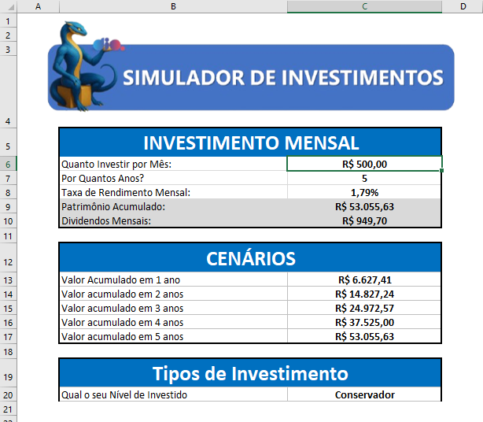

# 🧠 Bootcamp Santander - Excel com Inteligência Artificial

Este repositório reúne os **desafios de projeto** e a **contracapa personalizada** que desenvolvi durante minha participação no bootcamp **Santander - Excel com Inteligência Artificial**, promovido pela [DIO](https://www.dio.me/) em parceria com o **Santander**.

---

## 📘 Sobre o Bootcamp

Uma jornada completa com **26 horas de conteúdo prático**, para aprender Excel do zero e dominar as principais práticas do mercado com o apoio da Inteligência Artificial.

Durante o bootcamp, exploramos:

- 🧮 Fórmulas e funções essenciais do Excel
- 📊 Criação de relatórios eficientes e visualmente organizados
- 🤖 Aplicação de Inteligência Artificial no tratamento e exibição de dados
- 🧾 Projetos como:
  - Organizador de Imposto de Renda
  - Controlador de Investimentos

---

## Desafio 01 - Controlador de Investimentos

