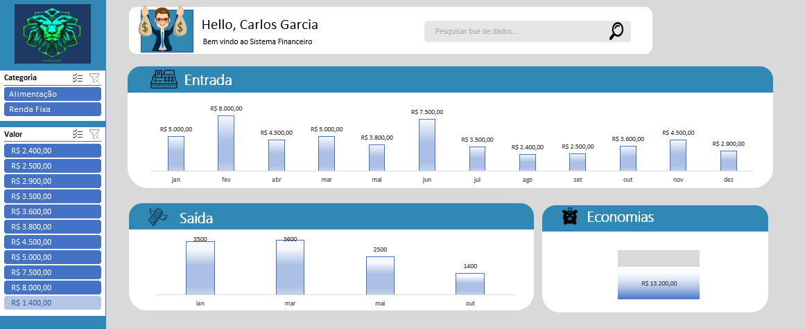

# Bootcamp CAIXA - IA Generativa com Microsoft Copilot

## Sobre o Bootcamp

O Bootcamp **CAIXA - IA Generativa com Microsoft Copilot** é uma imersão prática no universo da Inteligência Artificial Generativa, voltado para profissionais de todas as áreas, mesmo aqueles sem experiência prévia em desenvolvimento. Durante o programa, aprendemos a integrar IA em tarefas do cotidiano com comandos precisos, criando projetos incríveis como:

- **Podcast automatizado**: Um projeto para criar episódios únicos utilizando IA.
- **Controlador de finanças**: Uma aplicação para gerenciar finanças pessoais de forma prática e inteligente.
- **E-book automatizado**: Produção de livros digitais apenas com prompts bem estruturados.

Este bootcamp me proporcionou ferramentas e conhecimentos fundamentais para explorar as possibilidades da IA generativa e aplicar soluções criativas em diversos contextos.

---

## Dashboard Financeiro

Como parte dos desafios do Bootcamp, desenvolvi um **Dashboard Financeiro** utilizando IA generativa para facilitar o controle e análise de finanças pessoais.

### Recursos do Dashboard:

- **Análise automatizada de dados financeiros**: Insights rápidos sobre receitas, despesas e investimentos.
- **Visualizações interativas**: Gráficos e tabelas dinâmicas para um entendimento mais claro dos dados.
- **Facilidade de uso**: Interface simples e acessível para qualquer usuário.

### Captura de tela do dashboard

---

## Tecnologias Utilizadas

- **Microsoft Copilot**: IA generativa para automação e insights.
- **Excel Avançado**: Construção de gráficos, tabelas e fórmulas inteligentes.
