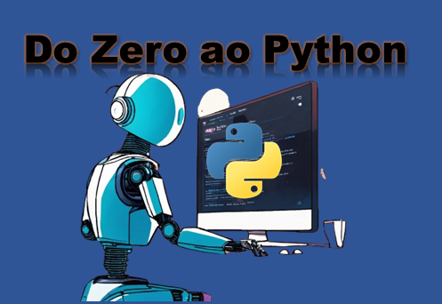

# Desafio de Projeto DIO
## Bootcamp: Santander 2024 - Fundamentos de IA para Devs
## Criando um Podcast com IAs Generativas

> DESCRIÇÃO: Chegou a hora de pôr as ferramentas de IA a prova, vamos construir um podcast utilizando ferramentas de IA para isso, vamos utilizar o ChatGPT para criar um título atrativo e um roteiro magnético para o nosso podcast, vamos extrair o máximo de poder do Midjourney para gerar uma capa personalizada e ainda utilizar o ElevenLabs para gerar um conteúdo de voz mais humanizado.

### Prompt utilizado no chatGpt para obter o podcast:
agora você é um desenvolvedor de software junior com foco em python e dono de um podcast que ensina o passo a passo da linguagem python.
Crie um episódio completo de um podcast chamado do zero ao python estruturado conforme as regras abaixo, dividindo o podcast em tres partes e uma conclusão, 
{REGRAS}
> [PARTE 1] = introdução ao python, como surgiu, quando surgiu e curisosidades sobre a linguagem;
> [PARTE 2] = como instalar o python e como fazer seu primeiro hello world;
> [PARTE 3] = diferenças entre as IDE Pycharm e VS Code;
> [CONCLUSÃO]
> cada um desses tópicos deve ter no mínimo 15 linhas e explicar de forma simples, como se fosse para uma criança de dez anos, porém em um tom como se fosse um desenolvedor junior escrevendo este podcast.

### Imagem utilizada no canal:
Busquei a imagem no Lexica e pesquisei por "programação futuro".
Removi o fundo da imagem e fiz as devidas finalizações pelo Powe Point.

### Local usado para gerar a voz, leitura do texto do Podcast

