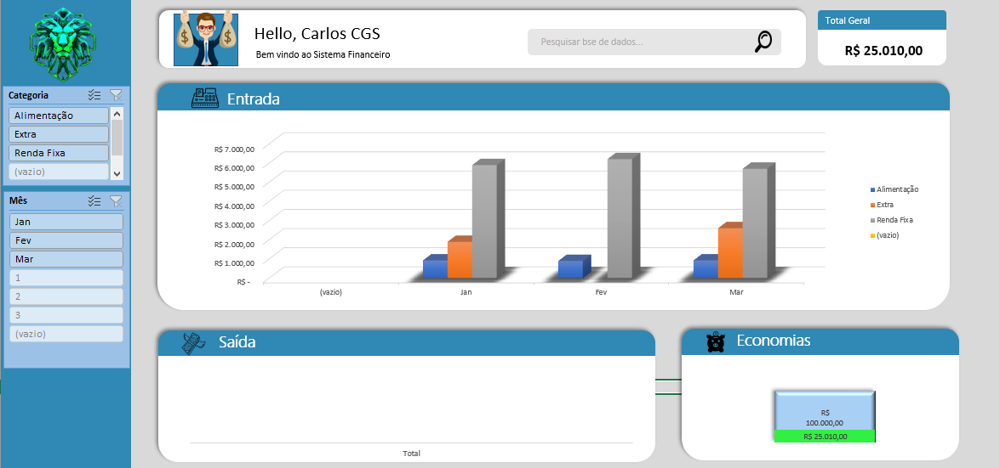

# Bootcamp Heineken - Inteligência Artificial Aplicada a Dados com Copilot

Este repositório contém a finalização de três projetos desenvolvidos durante o bootcamp Heineken - Inteligência Artificial Aplicada a Dados com Copilot. Cada um desses desafios envolveu a modelagem de banco de dados ou a criação de um dashboard financeiro.

---

## 📌 Projetos Incluídos

### 📦 Modelo Conceitual de Banco de Dados para E-commerce

Desenvolvimento de um esquema conceitual para um sistema de e-commerce, abordando as entidades, relacionamentos e restrições necessárias para garantir um banco de dados bem estruturado.

### 🛠️ Construindo um Esquema Conceitual para Banco de Dados de uma Oficina

Criação de um modelo conceitual de banco de dados voltado para a gestão de uma oficina mecânica, contemplando clientes, serviços, veículos, pagamentos e demais informações relevantes.

### 📊 Criando um Dashboard Financeiro

Elaboração de um dashboard interativo para análise financeira, permitindo a visualização de KPIs essenciais, como receita, despesas e balanço financeiro.

Abaixo está uma visualização do dashboard financeiro criado:

## 🛠 Tecnologias Utilizadas

- **Microsoft Excel** para criação do dashboard financeiro
- **Copilot** para assistência na geração de código e insights

## 🏆 Contracapa do Bootcamp

Este repositório também inclui uma contracapa contendo todos os detalhes dos cursos deste bootcamp. Ela foi criada para ser impressa na parte de trás dos certificados, facilitando a divulgação com a comunidade.

O arquivo está disponível para download:

📄 [Baixar Contracapa](contracapa-bootcamp.pdf)

## 📩 Contato

Se tiver alguma dúvida ou sugestão, entre em contato:

- **GitHub:** [Carlos-CGS](https://github.com/Carlos-CGS)
- **LinkedIn:** [linkedin.com/in/carlos-cgs](https://linkedin.com/in/carlos-cgs)
