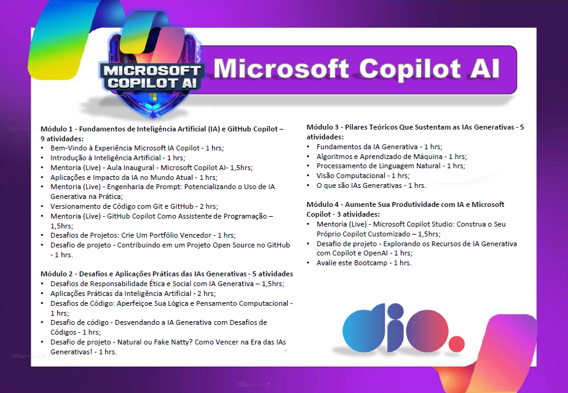

# Conclusão do Bootcamp Microsoft Copilot AI

Este repositório contém a contracapa que criei para compartilhar com a comunidade, destinada a ser impressa na parte de trás dos certificados do Bootcamp Microsoft Copilot AI. Esta contracapa resume as atividades realizadas durante o bootcamp e pode ser usada como complemento visual para destacar as conquistas obtidas.

## Módulos e Atividades

### Módulo 1: Fundamentos de Inteligência Artificial (IA) e GitHub Copilot
- **Bem-Vindo à Experiência Microsoft IA Copilot** - 1 hora
- **Introdução à Inteligência Artificial** - 1 hora
- **Mentoria (Live): Aula Inaugural - Microsoft Copilot AI** - 1.5 horas
- **Aplicações e Impacto da IA no Mundo Atual** - 1 hora
- **Mentoria (Live): Engenharia de Prompt: Potencializando o Uso de IA Generativa na Prática** - 1.5 horas
- **Versionamento de Código com Git e GitHub** - 2 horas
- **Mentoria (Live): GitHub Copilot como Assistente de Programação** - 1.5 horas
- **Desafios de Projetos: Crie um Portfólio Vencedor** - 1 hora
- **Desafio de projeto: Contribuindo em um Projeto Open Source no GitHub** - 1 hora

### Módulo 2: Desafios e Aplicações Práticas das IAs Generativas
- **Desafios de Responsabilidade Ética e Social com IA Generativa** - 1.5 horas
- **Aplicações Práticas de Inteligência Artificial** - 2 horas
- **Desafios de Código: Aperfeiçoe Sua Lógica e Pensamento Computacional com IA** - 1 hora
- **Desafio de Código: Desvendando a IA Generativa com Copilot** - 1.5 horas
- **Desafio de projeto: Natural ou Fake Natty? Como Vencer na Era das IAs Generativas!** - 1 hora

### Módulo 3: Pilares Teóricos Que Sustentam as IAs Generativas
- **Fundamentos da IA Generativa** - 1 hora
- **Algoritmos e Aprendizado de Máquina** - 1 hora
- **Processamento de Linguagem Natural** - 1 hora
- **Visão Computacional** - 1 hora
- **O que são IAs Generativas** - 1 hora

### Módulo 4: Aumente Sua Produtividade com IA e Microsoft Copilot
- **Mentoria (Live): Microsoft Copilot Studio: Construa o Seu Próprio Copilot Customizado** - 1.5 horas
- **Desafio de projeto: Explorando os Recursos de IA Generativa com Copilot e OpenAI** - 1 hora
- **Avalie este Bootcamp** - 1 hora

## Como Usar a Contracapa

1. **Baixe a contracapa**: Acesse a imagem da contracapa neste repositório.
2. **Impressão**: Imprima a contracapa no verso dos certificados do bootcamp.
3. **Compartilhamento**: Sinta-se à vontade para compartilhar a contracapa com outros participantes ou para fins de divulgação.

## Agradecimentos

Agradeço à Microsoft pelo BootCamp - Microsoft Copilot AI e à DIO pela oportunidade de aprender e crescer nessa jornada de Inteligência Artificial e GitHub Copilot.

## Contato

Para mais informações ou para compartilhar como você usou esta contracapa, entre em contato comigo pelo LinkedIn ou GitHub.

- LinkedIn: [LinkedIn - Carlos-CGS](https://www.linkedin.com/in/carlos-cgs/)
- GitHub: [GitHub - Carlos-CGS](https://github.com/Carlos-CGS)
