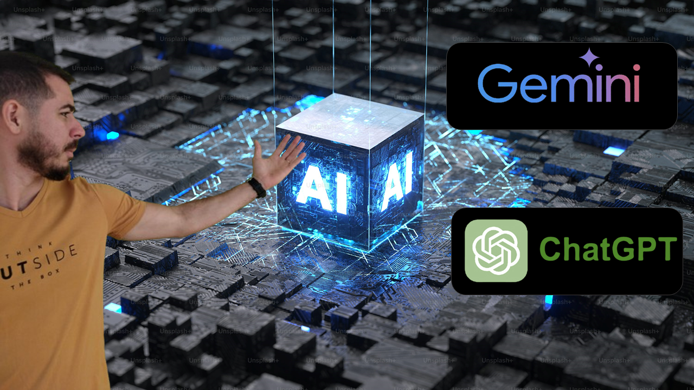

# Inteligência Artificial (IA)

>A inteligência artificial (IA) é treinada com base em modelos de linguagem massivamente escaláveis (LLM), gerando resultados com base nas informações que recebe durante o treinamento. 

>Anteriormente, deveríamos saber todas as respostas, porém em um mundo de IA, a necessidade de fazer as perguntas corretas se torna crucial para obter os resultados desejados. Ao invés de saber as respostas, o importante é formular as perguntas corretas.

### 💡 **Dicas para Criar Prompts Assertivos**  

1. **Seja específico:** Quanto mais detalhado for o seu pedido, mais precisa será a resposta.  
2. **Peça o formato correto:** Se deseja código, peça em Markdown; se precisa de uma lista, especifique.  
3. **Contextualize:** Explique o que já sabe e o que precisa aprender.  
4. **Use exemplos e referências:** Isso ajuda a IA a entender melhor sua intenção.  
5. **Revise e ajuste:** Caso a resposta não seja ideal, refine o prompt e tente novamente. 

#### Como Ser Mais Assertivo ao Fazer Perguntas às IA Generativas  

| Conceito                                | O Que Faz                                             | Exemplo de Utilização                                                                       |
|-----------------------------------------|-------------------------------------------------------|------------------------------------------------------------------------------------|
| **Receba Textos e Aguarde**             | Garante que a IA tenha todas as informações antes de responder. | "Aguarde até que todos os textos e instruções sejam fornecidos antes de gerar uma resposta." |
| **Definir o "Tom" da Resposta**         | Define se a resposta deve ser formal, descontraída, técnica, etc. | "Explique como funciona o React de forma descontraída e amigável." |
| **Correções Linguísticas**              | Corrige erros gramaticais e melhora a clareza do texto. | "Corrija os erros gramaticais e reescreva este texto de forma clara e objetiva." |
| **ELI5 (Explain Like I'm 5)**           | Explica conceitos de forma extremamente simples, como para uma criança. | "Explique Programação Orientada a Objetos em C# no estilo ELI5." |
| **TL;DR (Too Long; Didn't Read)**       | Resume textos longos de forma objetiva e clara. | "TL;DR deste artigo: [insira o link aqui]" |
| **Prompt Engineering**                  | Formula perguntas precisas para respostas mais relevantes. | "Liste 5 vantagens do uso de TypeScript no desenvolvimento frontend." |
| **Definir Formato de Saída**            | Especifica o formato desejado para a resposta, como lista, tabela, código, etc. | "Liste as diferenças entre Python e JavaScript em formato de tabela." |
| **Especificar Contexto**                | Dá à IA mais informações sobre o que se deseja saber. | "Explique o conceito de Machine Learning considerando sua aplicação em fintechs." |
| **Passo a Passo**                       | Solicita que a resposta seja detalhada e estruturada. | "Explique como conectar um banco de dados MySQL ao Node.js passo a passo." |
| **Fornecer Exemplos**                   | Melhora a resposta ao pedir exemplos práticos. | "Dê exemplos práticos de uso de hooks no React." |
| **Iteração e Refinamento**              | Pede para a IA refazer ou ajustar a resposta conforme necessidade. | "Reescreva a explicação anterior de forma mais técnica e aprofundada." |

---
### Ferramentas de IA Generativa Organizadas por Tipo

#### IAs Generativas  
| Nome               | O Que Faz                                                 | Link                                       |  
|--------------------|----------------------------------------------------------|-------------------------------------------|  
| ChatGPT           | Ferramenta para processamento de linguagem natural treinada pela OpenAI | [Link](https://chat.openai.com/) |  
| Google Bard       | Gerar textos automáticos, traduzir documentos, responder perguntas e realizar comandos | [Link](https://gemini.google.com/app) |  
| Claude            | Chatbot corporativo da Claude                            | [Link](https://claude.ai/login?returnTo=%2F) |  
| Cohere            | Plataforma de IA generativa                              | [Link](https://cohere.com/) |  
| Gamma             | Criador de apresentações com IA Generativa               | [Link](https://gamma.app/?lng=en) |  
| POE               | Conjunto de assistentes de IA generativa                 | [Link](https://poe.com/) |  
| Jasper.IA         | Criação de conteúdos para Marketing com IA               | [Link](https://www.jasper.ai/) |  
| AIPRM for ChatGPT | Criador de prompts para ChatGPT e IAs Generativas        | [Link](https://app.aiprm.com/) |  
| Gemini (Google)   | IA da Google para gerar textos, traduzir documentos e responder perguntas | [Link](https://gemini.google.com/app) |  
| Copilot (Microsoft) | Assistente de IA da Microsoft integrado ao ecossistema da empresa como VsCode e outras ferramentas | [Link](https://copilot.microsoft.com/) |  
| Perplexity        | IA especializada em busca e respostas baseadas em fontes confiáveis | [Link](https://www.perplexity.ai/) |  
| DeepSeek          | Modelo de IA generativa Chinesa focada em compreensão e geração de texto | [Link](https://deepseek.com/) | 
| Mistral AI       | Modelos de IA open-source especializados em geração de texto e código | [Link](https://mistral.ai/) |  
| Llama (Meta)     | Modelos de IA desenvolvidos pela Meta para geração de linguagem natural | [Link](https://ai.meta.com/llama/) |  
| HuggingChat      | Chatbot open-source baseado em modelos da Hugging Face    | [Link](https://huggingface.co/chat/) |  
| Open Assistant   | Assistente de IA open-source treinado para conversas naturais e úteis | [Link](https://open-assistant.io/) |  

---
#### IA Generativa de Imagens
| Nome             | O Que Faz                                       | Link                                               |
|------------------|-------------------------------------------------|----------------------------------------------------|
| DALL-E 3         | Gerador de imagens da OpenAI                    | [Link](https://openai.com/dall-e-3)                |
| Stable Diffusion | Gerador de imagens com prompts negativos        | [Link](https://stablediffusionweb.com/)            |
| Leonardo IA      | Ferramenta de geração de imagens                | [Link](https://app.leonardo.ai/?via=manh&gad_source=1) |
| MidJourney       | Gerador de imagens com IA Generativa            | [Link](https://www.midjourney.com/home)            |
| ArtBreeder       | Ferramenta de composição de imagens             | [Link](https://www.artbreeder.com/)                |
| CleanUp Pictures | Remoção de itens em fotos com IA               | [Link](https://cleanup.pictures/)                  |
| Looka            | Gerador de logotipos e fontes com IA           | [Link](https://looka.com/)                        |
| Bing Copilot     | Gerador de imagens e respostas via IA da Microsoft | [Link](https://www.bing.com/images/create)         |

---
#### Outras Ferramentas de IA
| Nome              | O Que Faz                                       | Link                                           |
|-------------------|-------------------------------------------------|------------------------------------------------|
| ZeroGPT           | Verifica se um texto foi gerado por IA          | [link](https://www.zerogpt.com/)               |
| Reesctitor        | Faz textos de IA ficarem parecidos com textos humanos | [link](https://reescritor.net/)          |
| Venturus IA       | Análise SWOT do seu negócio com IA generativa  | [Link](https://venturusai.com/)                |
| ElevenLabs        | Leitura de textos com até 2500 caracteres e várias vozes | [Link](https://elevenlabs.io/)                 |
| HeyGen            | Gerador de vídeos com IA generativa e avatares  | [Link](https://www.heygen.com/)                |
| Obviously.AI      | Análise e projeção de dados                    | [Link](https://www.obviously.ai/)              |
| Extra Great IA    | Criador de jogos com IA através de prompts     | [Link](https://extragreat.ai/)                 |
| Profile Pic Maker | Edição de fotos para perfil com IA generativa  | [Link](https://pfpmaker.com/)                  |
| Signature Hound   | Gerador assinaturas para e-mail                | [Link](https://signaturehound.com/)            |
| Invideo           | Criação e edição de vídeos através de prompts | [Link](https://invideo.io/)                    |
| Onlycoms          | Criação de nomes de domínios para sites        | [Link](https://onlycoms.com/)                  |
| Essense.io        | Análise de sentimentos sobre app stores        | [Link](https://www.essense.io/)                |
| Delete.bg         | Remoção de fundo de imagens                    | [Link](https://www.delete.bg/pt)              |
| Type.ai           | Criação de textos a partir de descrições       | [Link](https://type.ai/)                       |
| ChatDOC           | Perguntas sobre arquivos PDF                   | [Link](https://chatdoc.com/)                   |
| FixMyResume       | Correções em currículos                        | [Link](https://www.fixmyresume.xyz/)           |
| AgentGPT          | Agente pessoal baseado em IA generativa        | [Link](https://agentgpt.reworkd.ai/pt)         |
| Sider Chat        | Resumo de PDFs para estudos                    | [Link](http://sider.ai/)                       |

A inteligência artificial não veio para retirar empregos das pessoas, mas sim para aumentar a produtividade, automatizando tarefas repetitivas e liberando tempo para resolver problemas do dia a dia.
