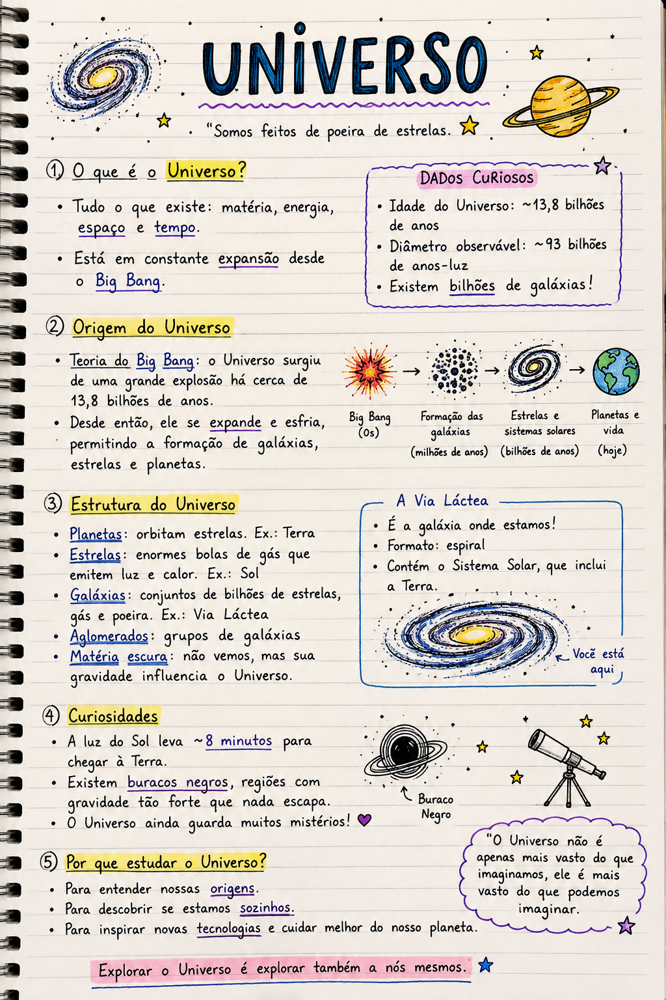
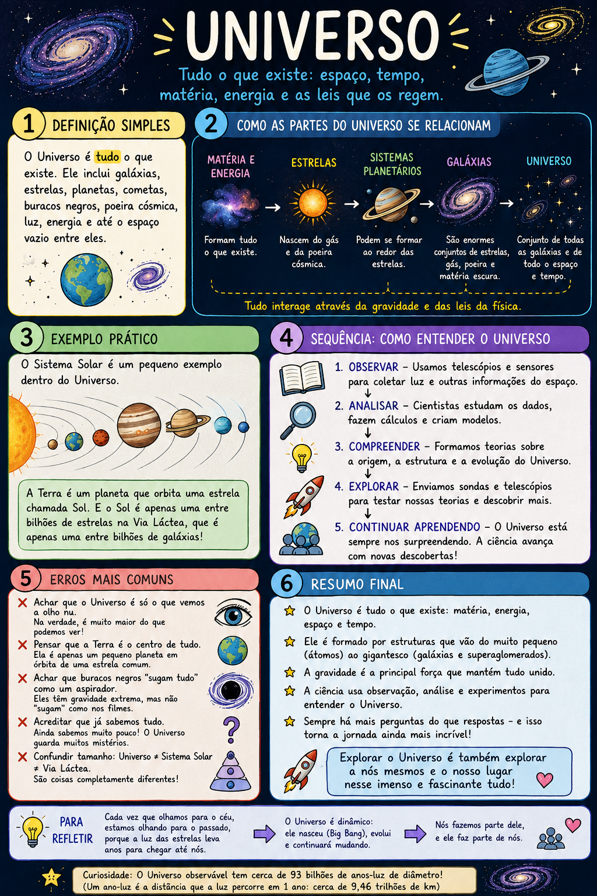
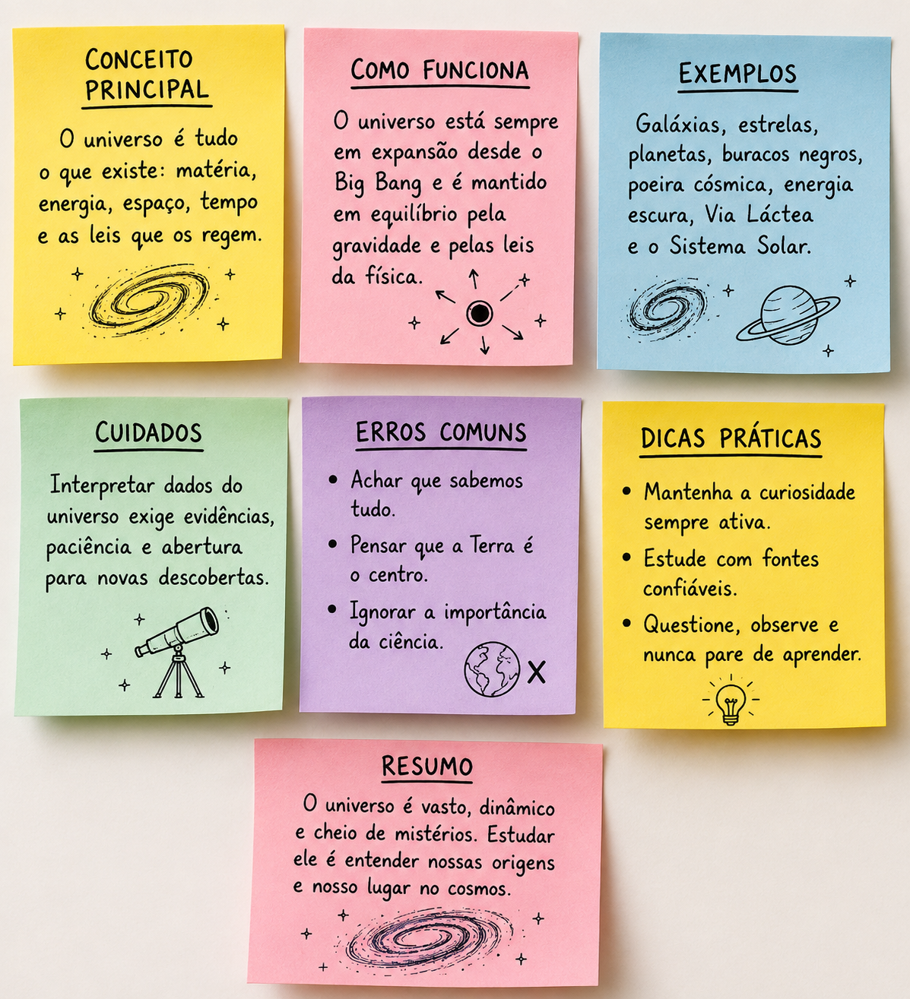
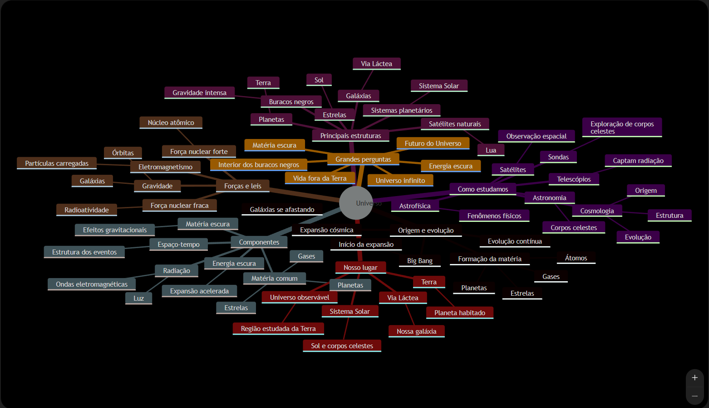
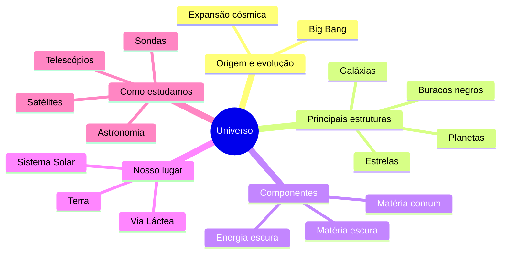

# 🤖 Inteligência Artificial: Ferramentas, Modelos e Prompts

> Um guia prático e organizado para conhecer ferramentas de inteligência artificial, acompanhar modelos recentes e utilizar prompts em estudos, programação, produtividade e criação de conteúdo.


<div align="center">


</div>

---

## 📌 Sobre este repositório

A inteligência artificial está presente em assistentes conversacionais, mecanismos de pesquisa, ferramentas de programação, geração de imagens, edição de vídeos, criação de áudio, automações e diversas outras aplicações.

Este repositório foi criado para reunir:

- ferramentas úteis de inteligência artificial;
- modelos de IA recentes e relevantes;
- prompts reutilizáveis;
- assistentes de programação;
- ferramentas para estudos e pesquisa;
- soluções para imagens, vídeos e áudio;
- boas práticas de segurança e validação.

> Ferramentas e modelos de IA mudam rapidamente. Disponibilidade, preços, limites e nomes podem ser alterados em qualqeur data futura, então confira antes.

---

## 📑 Índice

- [🚀 Comece por aqui](#-comece-por-aqui)
- [🧠 Como criar bons prompts](#-como-criar-bons-prompts)
- [🆕 Modelos de IA recentes](#-modelos-de-ia-recentes)
- [💬 Assistentes de IA](#-assistentes-de-ia)
- [💻 IA para programação](#-ia-para-programação)
- [🧑‍💻 Guia rápido do Claude Code](#-guia-rápido-do-claude-code)
- [🎨 IA para imagens e design](#-ia-para-imagens-e-design)
- [🎬 IA para vídeo e avatares](#-ia-para-vídeo-e-avatares)
- [🎵 IA para áudio, voz e música](#-ia-para-áudio-voz-e-música)
- [🔎 IA para pesquisa e estudos](#-ia-para-pesquisa-e-estudos)
- [📈 IA para produtividade e automação](#-ia-para-produtividade-e-automação)
- [🏠 Modelos locais, abertos e infraestrutura](#-modelos-locais-abertos-e-infraestrutura)
- [✅ Boas práticas](#-boas-práticas)
- [⌨️ Atalhos de prompts para ChatGPT e outras IAs](#️-atalhos-de-prompts-para-chatgpt-e-outras-ias)
- [🔗 Fontes oficiais para acompanhar novidades](#-fontes-oficiais-para-acompanhar-novidades)
- [🤝 Como contribuir](#-como-contribuir)
- [📜 Licença e contato](#-licença-e-contato)

---

## 🚀 Comece por aqui

Não existe uma única ferramenta melhor para todas as tarefas. A escolha depende do objetivo.

| Objetivo | Ferramentas sugeridas |
|---|---|
| Conversar, escrever e analisar arquivos | [ChatGPT](https://chatgpt.com/), [Claude](https://claude.ai/) e [Gemini](https://gemini.google.com/) |
| Pesquisar informações com fontes | [Perplexity](https://www.perplexity.ai/), ChatGPT com pesquisa e Gemini com pesquisa |
| Estudar usando documentos próprios | [NotebookLM](https://notebooklm.google/) |
| Trabalhar diretamente em um repositório | [Claude Code](https://docs.anthropic.com/en/docs/claude-code/overview) e [OpenAI Codex](https://developers.openai.com/codex/) |
| Programar dentro do editor | [GitHub Copilot](https://github.com/features/copilot), [Cursor](https://www.cursor.com/), [Windsurf](https://windsurf.com/) e [Kiro](https://kiro.dev/) |
| Criar aplicações por descrição | [Replit Agent](https://replit.com/ai), [v0](https://v0.dev/), [Lovable](https://lovable.dev/) e [Bolt](https://bolt.new/) |
| Criar imagens | ChatGPT, [Midjourney](https://www.midjourney.com/), [Ideogram](https://ideogram.ai/) e [Adobe Firefly](https://firefly.adobe.com/) |
| Criar ou editar vídeos | [Google Veo](https://deepmind.google/models/veo/), [Runway](https://runwayml.com/), [Kling AI](https://klingai.com/) e [Pika](https://pika.art/) |
| Criar narração e vozes | [ElevenLabs](https://elevenlabs.io/) e [PlayHT](https://play.ht/) |
| Criar músicas | [Suno](https://suno.com/) e [Udio](https://www.udio.com/) |
| Criar apresentações | [Gamma](https://gamma.app/) e [Canva](https://www.canva.com/magic-studio/) |
| Automatizar tarefas | [n8n](https://n8n.io/), [Make](https://www.make.com/) e [Zapier](https://zapier.com/ai) |
| Executar modelos no computador | [Ollama](https://ollama.com/) e [LM Studio](https://lmstudio.ai/) |

[⬆️ Voltar ao índice](#-índice)

---

## 🧠 Como criar bons prompts

Um prompt eficiente deve deixar claro **o que precisa ser feito, por que precisa ser feito e como o resultado deve ser entregue**.

### Estrutura recomendada

1. **Objetivo:** informe exatamente o que deseja.
2. **Contexto:** explique a situação, o público e o problema.
3. **Material de entrada:** forneça textos, dados, imagens ou códigos necessários.
4. **Restrições:** defina o que deve ou não aparecer.
5. **Formato de saída:** indique se deseja tabela, lista, código, Markdown, JSON ou texto.
6. **Critérios de qualidade:** determine o nível de detalhe, linguagem e tom.
7. **Validação:** peça para a IA verificar inconsistências antes de concluir.

### Modelo de prompt reutilizável

```text
Objetivo:
[Explique o resultado que deseja.]

Contexto:
[Descreva o cenário, o projeto e o público.]

Material de entrada:
[Insira os textos, dados, arquivos ou códigos.]

Tarefa:
[Explique o que a IA deve fazer.]

Requisitos:
- [Requisito 1]
- [Requisito 2]
- [Requisito 3]

Não faça:
- [Restrição 1]
- [Restrição 2]

Formato da resposta:
[Exemplo: Markdown, tabela, código completo ou passo a passo.]

Critérios de qualidade:
[Exemplo: linguagem simples, exemplos práticos e informações verificáveis.]

Antes de concluir:
Revise a resposta, identifique possíveis erros e informe qualquer ponto que precise ser confirmado.
```

### Exemplos de refinamento

| Pedido genérico | Pedido melhorado |
|---|---|
| Explique Python | Explique listas em Python para uma pessoa iniciante, com três exemplos comentados e um exercício final |
| Crie um site | Crie a estrutura de uma landing page responsiva usando HTML, CSS e JavaScript, com menu, apresentação, serviços e formulário |
| Corrija meu código | Analise o código, identifique o erro, explique a causa, apresente a correção e sugira um teste para validar |
| Resuma o texto | Resuma em cinco tópicos, preserve os conceitos principais e destaque decisões, riscos e próximos passos |
| Faça um README | Crie um README em Markdown com descrição, tecnologias, instalação, uso, estrutura de pastas, contribuição e licença |

[⬆️ Voltar ao índice](#-índice)

---

## 🆕 Modelos de IA recentes

> Lista de referência atualizada em **agosto de 2026**. A disponibilidade pode variar entre aplicativo, assinatura, API, região e fase de testes.

| Empresa | Modelos recentes ou relevantes | Uso principal | Link oficial |
|---|---|---|---|
| OpenAI | GPT-5.6 Sol, Terra e Luna | Raciocínio, trabalho profissional, agentes, programação e tarefas multimodais | [Modelos OpenAI](https://developers.openai.com/api/docs/models/all) |
| Anthropic | Claude Opus 5 e Claude Sonnet 5 | Programação, agentes, análise de documentos e tarefas longas | [Claude Opus 5](https://www.anthropic.com/news/claude-opus-5) |
| Google DeepMind | Gemini 3.5, Gemini 3.6 Flash e Gemini Omni | Multimodalidade, pesquisa, agentes e integração com serviços Google | [Modelos Gemini](https://deepmind.google/models/) |
| xAI | Grok 4.5 | Programação, agentes, pesquisa e produtividade | [Grok 4.5](https://x.ai/news/grok-4-5) |
| DeepSeek | DeepSeek V4 Flash e V4 Pro Preview | Raciocínio, programação, agentes e uso por API | [DeepSeek V4](https://api-docs.deepseek.com/news/news260424/) |
| Mistral AI | Mistral Large 3, Medium 3.5 e Small 4 | Modelos empresariais, multimodalidade, programação e implantação flexível | [Notícias da Mistral](https://mistral.ai/news/) |
| Meta | Llama 4 | Modelos de pesos abertos e aplicações multimodais | [Meta Llama](https://ai.meta.com/llama/) |
| Alibaba Cloud | Qwen3 e Qwen3-Coder | Raciocínio, programação e modelos de pesos abertos | [Blog Qwen](https://qwenlm.github.io/blog/) |
| Maritaca AI | Sabiá 4 e Sabiazinho 4 | Português brasileiro, contexto local e aplicações nacionais | [Maritaca AI](https://www.maritaca.ai/) |

### Modelo não é a mesma coisa que ferramenta

- **Modelo:** tecnologia que processa e gera informações, como GPT, Claude, Gemini ou Llama.
- **Ferramenta:** aplicativo que utiliza um ou mais modelos, como ChatGPT, Cursor, NotebookLM ou Gamma.
- **Agente:** sistema capaz de planejar etapas, utilizar ferramentas e executar ações.
- **API:** forma de integrar um modelo ou serviço a outro sistema.
- **Pesos abertos:** modelos cujos parâmetros podem ser baixados conforme a licença definida pelo fornecedor.
- **Código aberto:** software cujo código-fonte está disponível sob uma licença específica.

[⬆️ Voltar ao índice](#-índice)

---

## 💬 Assistentes de IA

| Ferramenta | Para que serve | Link |
|---|---|---|
| ChatGPT | Escrita, pesquisa, arquivos, imagens, análise, programação e produtividade | [Acessar](https://chatgpt.com/) |
| Claude | Escrita, raciocínio, análise de arquivos, programação e projetos extensos | [Acessar](https://claude.ai/) |
| Gemini | Assistente do Google para pesquisa, multimodalidade e integração com serviços Google | [Acessar](https://gemini.google.com/) |
| Microsoft Copilot | Assistente integrado ao ecossistema Microsoft | [Acessar](https://copilot.microsoft.com/) |
| Perplexity | Pesquisa na web com apresentação de fontes | [Acessar](https://www.perplexity.ai/) |
| Grok | Assistente da xAI para perguntas, pesquisa, criação e programação | [Acessar](https://grok.com/) |
| Le Chat | Assistente da Mistral AI | [Acessar](https://chat.mistral.ai/) |
| DeepSeek Chat | Assistente para texto, raciocínio e programação | [Acessar](https://chat.deepseek.com/) |
| Qwen Chat | Assistente da família Qwen | [Acessar](https://chat.qwen.ai/) |
| Meta AI | Assistente da Meta integrado aos seus produtos | [Acessar](https://www.meta.ai/) |
| Poe | Plataforma para acessar diferentes bots e modelos | [Acessar](https://poe.com/) |
| HuggingChat | Interface da Hugging Face para conversar com modelos abertos | [Acessar](https://huggingface.co/chat/) |
| Maritaca AI | Assistente e API com foco em português brasileiro | [Acessar](https://www.maritaca.ai/) |

[⬆️ Voltar ao índice](#-índice)

---

## 💻 IA para programação

### Assistentes e agentes de código

| Ferramenta | Para que serve | Link |
|---|---|---|
| Claude Code | Agente de programação para terminal, IDE, navegador e projetos completos | [Documentação](https://docs.anthropic.com/en/docs/claude-code/overview) |
| OpenAI Codex | Agente para compreender repositórios, alterar arquivos, executar testes e revisar código | [Documentação](https://developers.openai.com/codex/) |
| GitHub Copilot | Sugestões, chat, edição e agentes integrados ao fluxo do GitHub e IDEs | [Acessar](https://github.com/features/copilot) |
| Cursor | Editor de código com recursos de IA e agentes | [Acessar](https://www.cursor.com/) |
| Windsurf | Ambiente de desenvolvimento com assistência de IA | [Acessar](https://windsurf.com/) |
| Gemini CLI | Agente de código aberto que leva o Gemini ao terminal | [GitHub](https://github.com/google-gemini/gemini-cli) |
| Kiro | IDE com IA orientada a especificações, tarefas e desenvolvimento estruturado | [Acessar](https://kiro.dev/) |
| Cline | Agente de código aberto para editor e terminal | [Documentação](https://docs.cline.bot/cline-overview) |
| Roo Code | Agentes de programação dentro do editor | [GitHub](https://github.com/RooCodeInc/Roo-Code) |
| Aider | Programação assistida por IA diretamente no terminal | [Acessar](https://aider.chat/) |
| Replit Agent | Criação e manutenção de aplicações dentro do Replit | [Acessar](https://replit.com/ai) |

### Prototipagem e criação de aplicações

| Ferramenta | Para que serve | Link |
|---|---|---|
| v0 | Criação de interfaces e aplicações web a partir de descrições | [Acessar](https://v0.dev/) |
| Lovable | Criação de aplicações full stack com linguagem natural | [Acessar](https://lovable.dev/) |
| Bolt | Desenvolvimento de aplicações diretamente no navegador | [Acessar](https://bolt.new/) |
| Firebase Studio | Prototipagem e desenvolvimento conectado ao ecossistema Firebase | [Acessar](https://firebase.studio/) |
| GitHub Spark | Criação de pequenas aplicações conectadas ao GitHub | [Acessar](https://github.com/features/spark) |

### O que pedir a uma IA de programação

- explicar uma base de código;
- localizar a causa de um bug;
- criar uma funcionalidade;
- escrever testes;
- revisar segurança;
- refatorar;
- documentar;
- analisar uma pull request;
- preparar migrações;
- criar scripts;
- gerar uma estrutura inicial;
- revisar acessibilidade;
- sugerir melhorias de desempenho.

[⬆️ Voltar ao índice](#-índice)

---

## 🧑‍💻 Guia rápido do Claude Code

O **Claude Code** é um agente de programação da Anthropic capaz de compreender um projeto, pesquisar arquivos, editar código, executar comandos e trabalhar com ferramentas de desenvolvimento.

### Onde ele pode ajudar

- desenvolvimento de funcionalidades;
- investigação de erros;
- refatoração de vários arquivos;
- execução e correção de testes;
- criação de documentação;
- revisão de pull requests;
- análise de segurança;
- automação de tarefas repetitivas;
- integração com ferramentas por MCP;
- utilização de instruções persistentes por meio do arquivo `CLAUDE.md`.

### Fluxo recomendado

1. Abra o terminal na pasta do projeto.
2. Garanta que o projeto esteja versionado com Git.
3. Crie um arquivo `CLAUDE.md` com regras, arquitetura e comandos do projeto.
4. Peça primeiro uma análise e um plano.
5. Autorize alterações por etapas.
6. Revise os arquivos modificados.
7. Execute testes, lint e build.
8. Confira o `git diff`.
9. Faça o commit somente depois da validação.

### Exemplo de `CLAUDE.md`

```markdown
# Instruções do projeto

## Objetivo
Aplicação web para gerenciamento de tarefas internas.

## Tecnologias
- Backend: .NET e C#
- Frontend: React e TypeScript
- Banco de dados: MySQL

## Regras
- Não alterar contratos públicos da API sem avisar.
- Não inserir segredos no código.
- Manter nomes de classes e métodos em inglês.
- Escrever mensagens e documentação em português.
- Criar ou atualizar testes após mudanças de comportamento.
- Executar lint, testes e build antes de concluir.

## Comandos
- Backend: `dotnet test`
- Frontend: `npm test`
- Build: `npm run build`
```

### Prompts úteis para Claude Code

#### Conhecer o projeto

```text
Analise este repositório sem alterar nenhum arquivo.

Explique:
- objetivo do sistema;
- arquitetura;
- principais pastas;
- fluxo de dados;
- dependências;
- como executar;
- riscos técnicos;
- partes que precisam de documentação.

Depois crie um plano de estudo do projeto para uma pessoa nova na equipe.
```

#### Implementar uma funcionalidade

```text
Analise a solicitação abaixo e não altere o código ainda:

[DESCREVA A FUNCIONALIDADE]

Localize as partes afetadas, identifique riscos, proponha um plano de implementação e liste os testes necessários.

Aguarde minha autorização antes de modificar os arquivos.
```

#### Corrigir um erro

```text
Investigue o erro abaixo:

[DESCREVA O ERRO]

Reproduza o problema quando possível, identifique a causa raiz, proponha a menor correção segura e crie um teste de regressão.

Não esconda o erro com tratamentos genéricos.
```

#### Revisar alterações

```text
Revise as alterações atuais do Git.

Procure:
- regressões;
- erros de lógica;
- problemas de segurança;
- falta de validação;
- testes ausentes;
- mudanças incompatíveis;
- código desnecessário.

Classifique os achados em crítico, alto, médio e baixo. Não modifique os arquivos.
```

### Links úteis do Claude Code

- [Visão geral](https://docs.anthropic.com/en/docs/claude-code/overview)
- [Início rápido](https://docs.anthropic.com/en/docs/claude-code/quickstart)
- [Referência da CLI](https://docs.anthropic.com/en/docs/claude-code/cli-reference)
- [Memória e CLAUDE.md](https://docs.anthropic.com/en/docs/claude-code/memory)
- [Skills](https://docs.anthropic.com/en/docs/claude-code/skills)
- [Recursos e extensões](https://docs.anthropic.com/en/docs/claude-code/features-overview)

[⬆️ Voltar ao índice](#-índice)

---

## 🎨 IA para imagens e design

| Ferramenta | Para que serve | Link |
|---|---|---|
| ChatGPT Images | Geração e edição de imagens por conversa | [Acessar](https://chatgpt.com/) |
| Midjourney | Geração de imagens artísticas e conceituais | [Acessar](https://www.midjourney.com/) |
| Ideogram | Geração de imagens com atenção a textos e composição | [Acessar](https://ideogram.ai/) |
| Adobe Firefly | Geração e edição integrada ao ecossistema Adobe | [Acessar](https://firefly.adobe.com/) |
| Leonardo AI | Criação de imagens, elementos visuais e recursos para design | [Acessar](https://leonardo.ai/) |
| Recraft | Design, vetores, ilustrações e identidade visual | [Acessar](https://www.recraft.ai/) |
| FLUX | Família de modelos de imagem da Black Forest Labs | [Acessar](https://bfl.ai/) |
| Stability AI | Modelos e ferramentas para geração de mídia | [Acessar](https://stability.ai/) |
| Canva Magic Studio | Recursos de IA dentro do Canva | [Acessar](https://www.canva.com/magic-studio/) |
| Cleanup.pictures | Remoção de objetos em imagens | [Acessar](https://cleanup.pictures/) |
| remove.bg | Remoção automática de fundo | [Acessar](https://www.remove.bg/) |
| Looka | Criação assistida de logotipos e identidade visual | [Acessar](https://looka.com/) |

### Estrutura básica para prompts de imagem

```text
Crie uma imagem de [ASSUNTO].

Ambiente:
[LOCAL E CONTEXTO]

Composição:
[POSIÇÃO DOS ELEMENTOS E ENQUADRAMENTO]

Estilo:
[REALISTA, ILUSTRAÇÃO, 3D, EDITORIAL, ANIME ETC.]

Iluminação:
[TIPO DE LUZ]

Cores:
[PALETA]

Detalhes obrigatórios:
[ELEMENTOS IMPORTANTES]

Não incluir:
[ELEMENTOS INDESEJADOS]

Proporção:
[1:1, 16:9, 9:16, 3:1 ETC.]
```

[⬆️ Voltar ao índice](#-índice)

---

## 🎬 IA para vídeo e avatares

| Ferramenta | Para que serve | Link |
|---|---|---|
| Google Veo | Geração de vídeos e recursos cinematográficos | [Acessar](https://deepmind.google/models/veo/) |
| Google Flow | Ambiente criativo para produção de cenas com modelos Google | [Acessar](https://labs.google/fx/tools/flow) |
| Runway | Geração, edição e transformação de vídeo | [Acessar](https://runwayml.com/) |
| Kling AI | Geração de vídeo por texto ou imagem | [Acessar](https://klingai.com/) |
| Pika | Criação de vídeos curtos e efeitos visuais | [Acessar](https://pika.art/) |
| Luma Dream Machine | Geração de vídeo e cenas a partir de prompts | [Acessar](https://lumalabs.ai/dream-machine) |
| HeyGen | Avatares, tradução, dublagem e vídeos de apresentação | [Acessar](https://www.heygen.com/) |
| Synthesia | Vídeos corporativos e educacionais com avatares | [Acessar](https://www.synthesia.io/) |
| CapCut | Edição de vídeo com diversos recursos de IA | [Acessar](https://www.capcut.com/) |
| InVideo | Criação de vídeos a partir de roteiros e prompts | [Acessar](https://invideo.io/) |
| Descript | Edição de vídeo e áudio baseada em transcrição | [Acessar](https://www.descript.com/) |

### Elementos de um bom prompt de vídeo

- duração;
- proporção;
- movimento da câmera;
- cenário;
- ação principal;
- aparência dos personagens;
- iluminação;
- estilo;
- ritmo;
- áudio;
- fala;
- elementos proibidos;
- quadro inicial e quadro final.

[⬆️ Voltar ao índice](#-índice)

---

## 🎵 IA para áudio, voz e música

| Ferramenta | Para que serve | Link |
|---|---|---|
| ElevenLabs | Voz sintética, dublagem, agentes de voz e recursos de áudio | [Acessar](https://elevenlabs.io/) |
| Suno | Criação de músicas por descrição | [Acessar](https://suno.com/) |
| Udio | Geração e edição de músicas | [Acessar](https://www.udio.com/) |
| Adobe Podcast | Limpeza e melhoria de áudio | [Acessar](https://podcast.adobe.com/) |
| Descript | Transcrição e edição de áudio e vídeo | [Acessar](https://www.descript.com/) |
| PlayHT | Vozes sintéticas e APIs de fala | [Acessar](https://play.ht/) |
| Murf | Narrações e produção de voz | [Acessar](https://murf.ai/) |
| Auphonic | Pós-produção e normalização de áudio | [Acessar](https://auphonic.com/) |

> [!CAUTION]
> Utilize clonagem de voz somente com autorização. Não use a voz ou a imagem de outra pessoa para enganar, fraudar ou atribuir falas que ela não realizou.

[⬆️ Voltar ao índice](#-índice)

---

## 🔎 IA para pesquisa e estudos

| Ferramenta | Para que serve | Link |
|---|---|---|
| NotebookLM | Estudo e síntese com base em fontes fornecidas pelo usuário | [Acessar](https://notebooklm.google/) |
| Perplexity | Pesquisa na web com fontes | [Acessar](https://www.perplexity.ai/) |
| Elicit | Apoio a revisões de literatura e pesquisa acadêmica | [Acessar](https://elicit.com/) |
| Consensus | Busca de respostas em publicações científicas | [Acessar](https://consensus.app/) |
| scite | Análise de citações e literatura científica | [Acessar](https://scite.ai/) |
| Semantic Scholar | Busca acadêmica e descoberta de artigos | [Acessar](https://www.semanticscholar.org/) |
| Connected Papers | Visualização de relações entre artigos | [Acessar](https://www.connectedpapers.com/) |
| ChatDOC | Perguntas e análises sobre documentos | [Acessar](https://chatdoc.com/) |

### Cuidados em pesquisa

- confira o título e os autores da fonte;
- valide a data de publicação;
- abra o documento original;
- diferencie preprint de artigo revisado;
- não cite uma fonte que você não leu;
- confira se a conclusão da IA realmente está presente no material;
- use fontes primárias sempre que possível.

[⬆️ Voltar ao índice](#-índice)

---

## 📈 IA para produtividade e automação

| Ferramenta | Para que serve | Link |
|---|---|---|
| Notion AI | Escrita, busca e organização dentro do Notion | [Acessar](https://www.notion.so/product/ai) |
| Gamma | Criação de apresentações, documentos e páginas | [Acessar](https://gamma.app/) |
| Canva Magic Studio | Design, apresentação, imagem e edição | [Acessar](https://www.canva.com/magic-studio/) |
| Napkin AI | Transformação de textos em elementos visuais | [Acessar](https://www.napkin.ai/) |
| Fathom | Gravação, transcrição e resumo de reuniões | [Acessar](https://fathom.video/) |
| Otter.ai | Transcrição e organização de reuniões | [Acessar](https://otter.ai/) |
| Zapier AI | Automação e integração entre serviços | [Acessar](https://zapier.com/ai) |
| Make | Criação visual de automações | [Acessar](https://www.make.com/) |
| n8n | Automação de fluxos com opção de auto-hospedagem | [Acessar](https://n8n.io/) |
| Miro AI | Brainstorming, diagramas e colaboração visual | [Acessar](https://miro.com/ai/) |

[⬆️ Voltar ao índice](#-índice)

---

## 🏠 Modelos locais, abertos e infraestrutura

| Ferramenta | Para que serve | Link |
|---|---|---|
| Ollama | Executar modelos localmente por terminal e API | [Acessar](https://ollama.com/) |
| LM Studio | Baixar, testar e executar modelos localmente com interface gráfica | [Acessar](https://lmstudio.ai/) |
| Hugging Face | Modelos, conjuntos de dados, demonstrações e bibliotecas | [Acessar](https://huggingface.co/) |
| Open WebUI | Interface local para conversar com modelos e serviços compatíveis | [Acessar](https://openwebui.com/) |
| OpenRouter | Acesso a diferentes modelos por uma API unificada | [Acessar](https://openrouter.ai/) |
| GroqCloud | Inferência rápida para modelos compatíveis | [Acessar](https://console.groq.com/) |

### Antes de executar um modelo local

Verifique:

- memória RAM;
- memória da GPU;
- tamanho do modelo;
- quantização;
- licença;
- contexto suportado;
- compatibilidade com sua máquina;
- privacidade desejada;
- velocidade esperada;
- custo de energia e infraestrutura.

[⬆️ Voltar ao índice](#-índice)

---

## ✅ Boas práticas

### Para qualquer IA

- forneça contexto suficiente;
- defina o formato desejado;
- revise a resposta;
- confirme fatos importantes;
- registre a fonte e a data;
- compare respostas quando o assunto for crítico;
- mantenha uma pessoa responsável pela decisão final.

### Para programação

- não compartilhe segredos;
- revise o código gerado;
- execute testes;
- use controle de versão;
- valide dependências;
- aplique lint e formatação;
- confira licenças;
- revise segurança;
- faça backup antes de grandes alterações.

### Para imagens, voz e vídeo

- respeite direitos autorais;
- obtenha autorização para uso de imagem e voz;
- informe quando um conteúdo sintético puder causar confusão;
- não produza falsificações enganosas;
- preserve os arquivos originais;
- confira as regras comerciais da ferramenta.

### Para empresas

- defina quais dados podem ser enviados;
- utilize contas corporativas quando necessário;
- controle acesso a APIs;
- registre uso e custos;
- estabeleça regras de retenção;
- avalie requisitos legais e contratuais;
- mantenha aprovação humana em decisões relevantes.

### Sobre detectores de texto por IA

Detectores podem gerar falsos positivos e falsos negativos. O resultado de um detector não deve ser tratado isoladamente como prova de autoria.

[⬆️ Voltar ao índice](#-índice)

---

## ⌨️ Atalhos de prompts para ChatGPT e outras IAs

### 1. `/generate-handwritten-image`

Cria uma imagem com aparência de anotação feita à mão em uma página de caderno.

<table width="100%">
  <tr>
    <th width="50%" align="left">📝 Prompt utilizado</th>
    <th width="50%" align="left">🖼️ Resultado gerado</th>
  </tr>
  <tr>
    <td width="50%" valign="top">
      <pre><code>/generate-handwritten-image

Crie uma imagem em formato de página de caderno
com anotações manuscritas sobre: [Universo].

Requisitos:
- título destacado;
- letra manuscrita legível;
- pequenos desenhos relacionados ao assunto;
- palavras importantes sublinhadas;
- uso moderado de marca-texto;
- organização em tópicos;
- aparência natural de estudo;
- conteúdo em português do Brasil;
- nenhuma informação cortada;
- proporção vertical.</code></pre>
    </td>
    <td width="50%" valign="top" align="center">
      <a href="./caderno_universo.png">
        
      </a>
      <br>
      <sub>Exemplo criado com o tema <strong>Universo</strong>.</sub>
    </td>
  </tr>
</table>

> [!TIP]
> Substitua `[Universo]` pelo assunto que deseja transformar em anotações de caderno.

---

### 2. `/visualize-learning`

Transforma um assunto em uma explicação visual organizada como infográfico educacional.

<table width="100%">
  <tr>
    <th width="50%" align="left">📝 Prompt utilizado</th>
    <th width="50%" align="left">🖼️ Resultado gerado</th>
  </tr>
  <tr>
    <td width="50%" valign="top">
      <pre><code>/visualize-learning

Explique visualmente o tema: [Universo].

Crie:
1. uma definição simples;
2. um diagrama mostrando como as partes se relacionam;
3. um exemplo prático;
4. uma sequência passo a passo;
5. os erros mais comuns;
6. um resumo final.

Use linguagem acessível e organize o conteúdo
como um infográfico educacional.</code></pre>
    </td>
    <td width="50%" valign="top" align="center">
      <a href="./explicacao_universo.png">
        
      </a>
      <br>
      <sub>Explicação visual completa sobre o <strong>Universo</strong>.</sub>
    </td>
  </tr>
</table>

> [!TIP]
> Esse modelo funciona bem para conteúdos educacionais, treinamentos, resumos de aulas e publicações.

---

### 3. `/sticky-notes`

Organiza os principais pontos de um assunto em notas adesivas curtas e independentes.

<table width="100%">
  <tr>
    <th width="50%" align="left">📝 Prompt utilizado</th>
    <th width="50%" align="left">🖼️ Resultado gerado</th>
  </tr>
  <tr>
    <td width="50%" valign="top">
      <pre><code>/sticky-notes

Organize o tema [Universo] em notas adesivas.

Separe as notas nas seguintes categorias:
- conceito principal;
- como funciona;
- exemplos;
- cuidados;
- erros comuns;
- dicas práticas;
- resumo.

Cada nota deve ter uma frase curta,
clara e independente.</code></pre>
    </td>
    <td width="50%" valign="top" align="center">
      <a href="./notas_universo.png">
        
      </a>
      <br>
      <sub>Resumo do tema em <strong>notas adesivas</strong>.</sub>
    </td>
  </tr>
</table>

> [!TIP]
> Para um resultado mais limpo, peça frases curtas e limite a quantidade de categorias.

---

### 4. `/mind-map`

Cria um mapa mental com um conceito central, categorias, subcategorias e relações entre os assuntos.

<table width="100%">
  <tr>
    <th width="50%" align="left">📝 Prompt utilizado</th>
    <th width="50%" align="left">🖼️ Resultado gerado</th>
  </tr>
  <tr>
    <td width="50%" valign="top">
      <pre><code>/mind-map

Crie um mapa mental sobre [Universo].

Use:
- um conceito central;
- categorias principais;
- subcategorias;
- palavras-chave;
- relações entre os conceitos;
- exemplos curtos.

Entregue primeiro em formato de árvore Markdown
e depois em código Mermaid.</code></pre>
    </td>
    <td width="50%" valign="top" align="center">
      <a href="./mermaid_universo.png">
        
      </a>
      <br>
      <sub>Mapa mental do <strong>Universo</strong> renderizado com Mermaid.</sub>
    </td>
  </tr>
</table>

> [!NOTE]
> O Mermaid pode ser renderizado diretamente pelo GitHub. A imagem é útil para mostrar uma prévia pronta e manter o mesmo visual em outros lugares.

<details>
  <summary><strong>Ver um exemplo resumido do código Mermaid</strong></summary>


```mermaid
mindmap
  root((Universo))
    Origem e evolução
      Big Bang
      Expansão cósmica
    Principais estruturas
      Galáxias
      Estrelas
      Planetas
      Buracos negros
    Componentes
      Matéria comum
      Matéria escura
      Energia escura
    Nosso lugar
      Terra
      Sistema Solar
      Via Láctea
    Como estudamos
      Telescópios
      Satélites
      Sondas
      Astronomia
```

</details>

---

### 5. `/flashcards`

Cria cartões de estudo.

```text
/flashcards

Crie 20 flashcards sobre [TEMA].

Formato:
Pergunta: [...]
Resposta: [...]

Distribuição:
- 8 questões básicas;
- 8 intermediárias;
- 4 avançadas.

As respostas devem ser curtas, corretas e fáceis de revisar.
```

### 6. `/quiz-me`

Cria um questionário e aguarda as respostas do usuário.

```text
/quiz-me

Aplique um quiz sobre [TEMA] com 10 perguntas, uma por vez.

Regras:
- não revele a resposta antes da minha tentativa;
- informe se acertei ou errei;
- explique a resposta;
- aumente gradualmente a dificuldade;
- apresente minha pontuação ao final;
- indique quais assuntos preciso revisar.
```

### 7. `/study-roadmap`

Cria um plano de estudos.

```text
/study-roadmap

Crie um plano de estudos para aprender [TEMA] em [PERÍODO].

Considere:
- meu nível atual: [NÍVEL];
- tempo disponível por dia: [TEMPO];
- objetivo final: [OBJETIVO].

Organize por semanas, com teoria, prática, exercícios, revisão e um projeto final.
```

### 8. `/explain-three-levels`

Explica o mesmo assunto em três níveis de dificuldade.

```text
/explain-three-levels

Explique [TEMA] em três níveis:

1. iniciante: linguagem simples e analogia;
2. intermediário: conceitos técnicos e exemplo;
3. avançado: detalhes, limitações e boas práticas.

Finalize comparando o que muda entre os três níveis.
```

### 9. `/compare`

Cria uma comparação estruturada.

```text
/compare

Compare [ITEM A] e [ITEM B].

Analise:
- definição;
- objetivo;
- vantagens;
- limitações;
- desempenho;
- facilidade de uso;
- custo;
- segurança;
- melhor cenário de aplicação.

Entregue em tabela e finalize com uma recomendação baseada em diferentes perfis de usuário.
```

### 10. `/summarize-with-sources`

Resume um conteúdo sem misturar fatos externos.

```text
/summarize-with-sources

Analise o material fornecido e produza:

1. resumo executivo;
2. conceitos principais;
3. dados e afirmações importantes;
4. decisões;
5. riscos;
6. próximos passos;
7. dúvidas que o material não responde.

Utilize somente as informações presentes no material. Não invente dados e indique claramente qualquer lacuna.
```

### 11. `/fact-check`

Ajuda a verificar uma afirmação.

```text
/fact-check

Verifique a seguinte afirmação: [AFIRMAÇÃO].

Procedimento:
1. separe fatos de opiniões;
2. procure fontes primárias e atuais;
3. compare pelo menos duas fontes;
4. informe a data das informações;
5. classifique como confirmada, parcialmente correta, sem evidência suficiente ou incorreta;
6. explique a conclusão sem exageros.
```

### 12. `/improve-prompt`

Melhora um prompt antes de executá-lo.

```text
/improve-prompt

Analise e melhore o prompt abaixo:

[PROMPT ORIGINAL]

Faça o seguinte:
- identifique ambiguidades;
- adicione contexto necessário;
- organize requisitos;
- defina o formato de saída;
- inclua critérios de qualidade;
- preserve minha intenção;
- entregue a versão final pronta para copiar.
```

### 13. `/decision-matrix`

Cria uma matriz de decisão.

```text
/decision-matrix

Ajude-me a escolher entre: [OPÇÕES].

Critérios:
[LISTE OS CRITÉRIOS]

Atribua pesos de 1 a 5, dê uma nota para cada opção, calcule o resultado e explique os principais fatores da decisão.

Não trate a pontuação como verdade absoluta. Destaque também riscos e critérios subjetivos.
```

### 14. `/code-review`

Realiza uma revisão estruturada de código.

```text
/code-review

Revise o código fornecido considerando:

- funcionamento;
- clareza;
- organização;
- duplicação;
- tratamento de erros;
- segurança;
- desempenho;
- acessibilidade, quando aplicável;
- testes;
- boas práticas da linguagem.

Primeiro liste os problemas por prioridade. Depois apresente as correções sugeridas. Não altere o comportamento esperado sem avisar.
```

### 15. `/debug`

Investiga um erro de programação.

```text
/debug

Analise o erro abaixo.

Contexto:
[DESCREVA O PROJETO]

Comportamento esperado:
[RESULTADO ESPERADO]

Comportamento atual:
[RESULTADO ATUAL]

Mensagem de erro:
[ERRO]

Código:
[CÓDIGO]

Entregue:
1. causa mais provável;
2. outras hipóteses;
3. passos de diagnóstico;
4. correção;
5. código ajustado;
6. teste para confirmar a solução.
```

### 16. `/refactor`

Refatora um código preservando seu comportamento.

```text
/refactor

Refatore o código fornecido sem alterar seu comportamento externo.

Objetivos:
- melhorar legibilidade;
- reduzir duplicação;
- separar responsabilidades;
- melhorar nomes;
- facilitar testes;
- manter compatibilidade.

Antes do código final, explique resumidamente as mudanças. Depois apresente os testes necessários para validar a refatoração.
```

### 17. `/generate-tests`

Gera uma estratégia de testes.

```text
/generate-tests

Crie testes para o código fornecido.

Inclua:
- caminho feliz;
- entradas inválidas;
- valores limites;
- exceções;
- regressões prováveis;
- mocks somente quando necessários.

Utilize [FRAMEWORK DE TESTES] e explique como executar os testes.
```

### 18. `/readme-generator`

Cria um README profissional.

```text
/readme-generator

Crie um README.md profissional para o projeto abaixo.

Projeto:
[DESCRIÇÃO]

Tecnologias:
[TECNOLOGIAS]

Inclua:
- apresentação;
- funcionalidades;
- demonstração;
- tecnologias;
- requisitos;
- instalação;
- configuração;
- variáveis de ambiente;
- execução;
- estrutura de pastas;
- testes;
- roadmap;
- contribuição;
- licença;
- autor.

Use Markdown compatível com GitHub e não invente recursos que o projeto não possui.
```

### 19. `/project-architect`

Ajuda a estruturar um projeto de software.

```text
/project-architect

Proponha uma arquitetura para o projeto: [DESCRIÇÃO].

Tecnologias obrigatórias:
[TECNOLOGIAS]

Considere:
- requisitos funcionais;
- requisitos não funcionais;
- organização de pastas;
- responsabilidades de cada camada;
- banco de dados;
- autenticação;
- API;
- validações;
- logs;
- testes;
- segurança;
- implantação.

Apresente primeiro a arquitetura e as decisões. Não gere todo o código antes de validar a estrutura.
```

### 20. `/image-prompt`

Transforma uma ideia simples em um prompt detalhado para geração de imagem.

```text
/image-prompt

Transforme a ideia abaixo em um prompt profissional para geração de imagem:

[IDEIA]

Defina:
- assunto principal;
- ambiente;
- composição;
- enquadramento;
- iluminação;
- cores;
- estilo visual;
- expressão;
- detalhes importantes;
- proporção;
- elementos que não devem aparecer.

Entregue uma versão em português e outra em inglês.
```

[⬆️ Voltar ao índice](#-índice)

---

## 🔗 Fontes oficiais para acompanhar novidades

| Empresa ou projeto | Página de atualização |
|---|---|
| OpenAI | [Modelos](https://developers.openai.com/api/docs/models/all) e [Research](https://openai.com/research/) |
| Anthropic | [Newsroom](https://www.anthropic.com/news) e [Claude Code Docs](https://docs.anthropic.com/en/docs/claude-code/overview) |
| Google DeepMind | [Modelos](https://deepmind.google/models/) |
| xAI | [Notícias](https://x.ai/news) |
| DeepSeek | [Atualizações da API](https://api-docs.deepseek.com/updates/) |
| Mistral AI | [Notícias](https://mistral.ai/news/) |
| Meta AI | [Blog](https://ai.meta.com/blog/) |
| Qwen | [Blog](https://qwenlm.github.io/blog/) |
| Maritaca AI | [Pesquisa](https://www.maritaca.ai/research) |
| Hugging Face | [Modelos](https://huggingface.co/models) |

[⬆️ Voltar ao índice](#-índice)

---

## 💭 Reflexão final

> A inteligência artificial não elimina a necessidade de conhecimento. Ela aumenta a importância de saber definir problemas, avaliar respostas, validar informações e tomar boas decisões.

A melhor utilização da IA acontece quando combinamos:

- conhecimento humano;
- contexto;
- boas perguntas;
- dados confiáveis;
- revisão;
- responsabilidade.

---

## 🤝 Como contribuir

Conheceu uma ferramenta útil ou identificou uma informação desatualizada?

1. Faça um fork do projeto.
2. Crie uma branch:

```bash
git checkout -b feature/nova-ferramenta
```

3. Adicione a ferramenta na categoria correta.
4. Utilize preferencialmente o link oficial.
5. Explique de forma clara o que a ferramenta faz.
6. Atualize a data de revisão quando necessário.
7. Envie um Pull Request.

### Padrão para adicionar ferramentas

```markdown
| Nome da ferramenta | Descrição curta e objetiva | [Acessar](LINK_OFICIAL) |
```

### Antes de enviar

- confirme que o link funciona;
- evite links de afiliados;
- verifique se a ferramenta ainda está disponível;
- não copie textos promocionais;
- não classifique uma ferramenta como gratuita sem verificar limites;
- informe quando o projeto for experimental;
- diferencie código aberto de pesos abertos.

---

## 📜 Licença e contato

📅 **Última atualização:** agosto de 2026  
⭐ **Se este repositório foi útil, deixe uma estrela.**  
💬 **Sugestões:** abra uma Issue ou envie um Pull Request.

<div align="center">

### Desenvolvido por Carlos-CGS

[](https://github.com/Carlos-CGS)
[](https://www.linkedin.com/in/carlos-cgs/)
[](https://carlos-cgs.github.io/CGS/)

</div>
