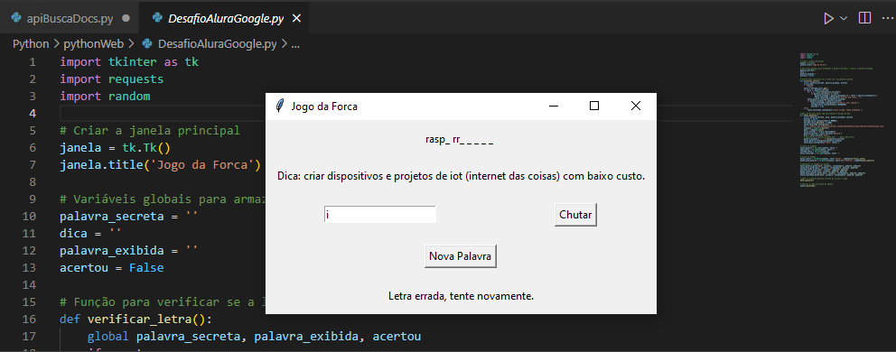

# Imersão Python Web Alura & Google

# Jogo da Forca em Python usando Tkinter

## Descrição
Este é um jogo da forca simples implementado em Python usando a biblioteca Tkinter para a interface gráfica. O jogo busca uma palavra secreta aleatória de uma API online e permite que o jogador adivinhe as letras para tentar descobrir a palavra. Quando o jogador acerta todas as letras da palavra secreta, uma mensagem de vitória é exibida.

## Funcionalidades
- O jogo exibe uma janela principal com uma interface gráfica simples.
- A palavra secreta é buscada aleatoriamente de uma API online.
- O jogador pode inserir letras para tentar adivinhar a palavra secreta.
- Uma dica é exibida para ajudar o jogador.
- Quando o jogador acerta todas as letras da palavra secreta, uma mensagem de vitória é exibida e a entrada de letras é bloqueada.

## Componentes Principais
- `verificar_letra()`: Função para verificar se a letra inserida pelo jogador está na palavra secreta.
- `obter_palavra()`: Função para buscar uma nova palavra secreta da API.
- `texto_palavra`: Label para exibir a palavra secreta com letras ocultas e reveladas.
- `texto_dica`: Label para exibir a dica da palavra secreta.
- `entrada_letra`: Entry para o jogador inserir letras.
- `texto_resultado`: Label para exibir mensagens de erro ou vitória.
- `botao_chutar`: Botão para o jogador confirmar a letra inserida.
- `botao_nova_palavra`: Botão para o jogador buscar uma nova palavra secreta.

## Uso
1. Execute o script Python.
2. Uma janela será exibida com a interface do jogo.
3. Insira letras na entrada de texto e pressione o botão "Chutar" para verificar se a letra está na palavra secreta.
4. Quando todas as letras da palavra secreta forem reveladas, uma mensagem de vitória será exibida.
5. Pressione o botão "Nova Palavra" para buscar uma nova palavra secreta e iniciar um novo jogo.

## Dependências
- tkinter: Biblioteca gráfica para Python.
- requests: Biblioteca para fazer requisições HTTP em Python.
- random: Biblioteca para gerar números aleatórios em Python.

